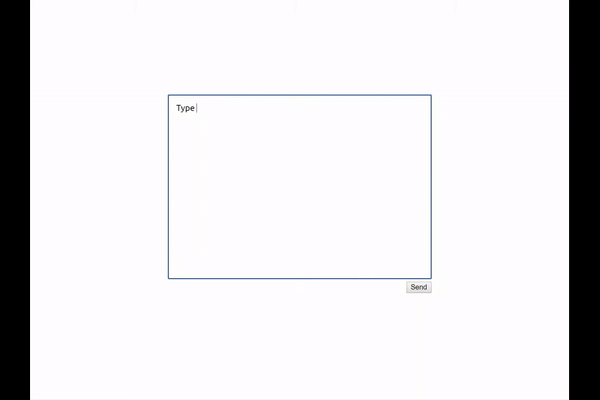

## Suggestion Box UI Test
I simple test of a letter-like component hiding inside another box-like component.

## Demo
Honestly just look at it [right here](https://privacypolicy.github.io/Suggestion-Box-UI/).

## Sample
If for some reason you're too lazy to click a link, here's a visual demo.

But wouldn't it be so much more fun to type your own message?
